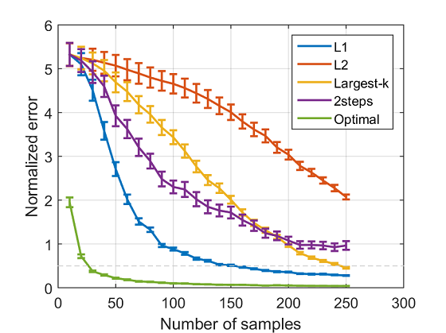
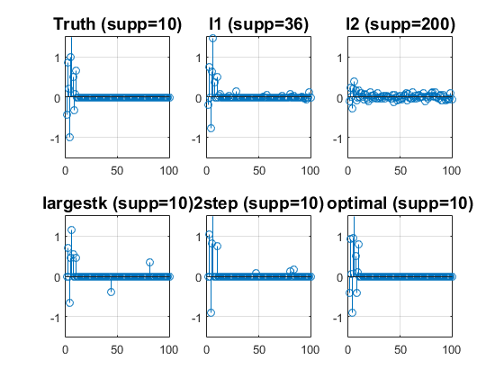
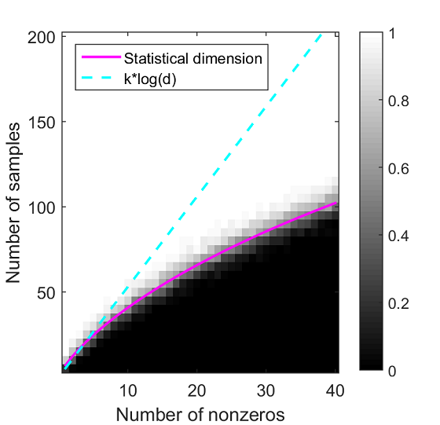

# 「スパース性に基づく機械学習」サポートページ

## プログラム
本書で用いた実験のMATLABソースコードを公開します．

### 過学習（2章）
```matlab
 plot_overfitting
```


### 人工データ実験（3章）
1. はじめにスパース正則化のための[双対拡張ラグランジュ(DAL)法のツールボックス](https://github.com/ryotat/dal)をダウンロードして下さい.
2. ツールボックスのパスを追加して下さい．

  ```matlab
  addpath /path/to/dal/matlab
  ```
3. 実行します．

  ```matlab
  exp_ksubset_correlated
  ```
4. 結果
 
5. 係数ベクトルを可視化するには```exp_ksubset_correlated.m```の９行目を
 
  ```matlab
  visualize_weights = 1;
  ```
としてから実行して下さい．

 
 
### 相転移と統計的次元（4章）
```matlab
 exp_lininvl1
 ```
 
 
 
### lassoの統計的性能（5章）

### 最適化アルゴリズムの比較（6章）

### フランク・ウォルフェ法（10章）

### ロバスト主成分を用いた前景抽出（10章）

1. [データ](http://perception.i2r.a-star.edu.sg/bk_model/bk_index.html)をダウンロード

