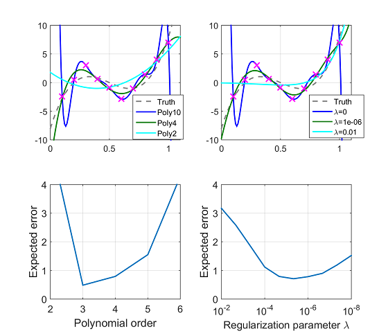
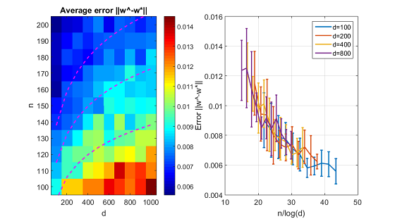
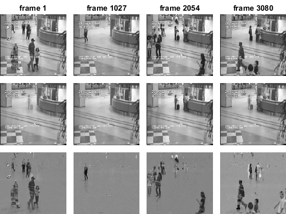

# 「スパース性に基づく機械学習」サポートページ

## 目次
1. はじめに
1. データからの学習
1. スパース性の導入
1. ノイズなしL1ノルム最小化の理論
1. ノイズありL1ノルム最小化の理論
1. L1ノルム正則化のための最適化法
1. グループL1ノルム正則化に基づく機械学習
1. トレースノルム正則化に基づく機械学習
1. 重複型スパース正則化
1. アトミックノルム
1. おわりに

* [目次PDF](http://www.kspub.co.jp/download/1529106a.pdf)

## プログラム
本書で用いた実験のMATLABソースコードを公開します．

### 過学習（2章）
```matlab
 plot_overfitting
```


### 人工データ実験（3章）
1. はじめにスパース正則化のための[双対拡張ラグランジュ(DAL)法のツールボックス](https://github.com/ryotat/dal)をダウンロードして下さい.
2. ツールボックスのパスを追加して下さい．

  ```matlab
  addpath /path/to/dal/matlab
  ```
3. 実行します．

  ```matlab
  exp_ksubset_correlated
  ```
4. 結果
 
5. 係数ベクトルを可視化するには```exp_ksubset_correlated.m```の９行目を
 
  ```matlab
  visualize_weights = 1;
  ```
としてから実行して下さい．

 
 
### 相転移と統計的次元（4章）
```matlab
 exp_lininvl1
 ```
 
 
 
### lassoの統計的性能（5章）
1. スパース正則化のための[双対拡張ラグランジュ(DAL)法のツールボックス](https://github.com/ryotat/dal)をダウンロードし，パスを追加して下さい（[3章](#人工データ実験3章)を参照）．
2. 実行します．

  ```matlab
  exp_lasso_scaling
  ```
3. 結果

 

### 最適化アルゴリズムの比較（6章）

### フランク・ウォルフェ法（10章）

### ロバスト主成分を用いた前景抽出（10章）

1. データ (Hall of a business building) をシンガポール科学技術研究庁インフォコム研究所 (I2R) の[ページ](http://perception.i2r.a-star.edu.sg/bk_model/bk_index.html)からダウンロード
2. `hall.zip`を展開し，`datasets/hall/`以下に置きます．
3. 実行します．

  ```matlab
  exp_hall
  ```
4. 結果

 

